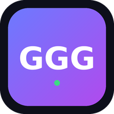

# GNW — Game New Watch 🎮

PC · 콘솔 · 모바일 **신작 게임 출시(예정) 및 주요 정보**를 한눈에 보는 웹앱.
하나의 `data/games.json` 데이터를 **웹앱**과 **아이폰 위젯**이 함께 사용하도록 설계되어,
어디서 보든 정보가 어긋나지 않습니다.



---

## ✨ 주요 기능

- **모든 신작 한 곳에** — PC / PS5 / Xbox / Switch / Switch 2 / 모바일 출시(예정)작 카탈로그
- **출시 카운트다운** — 각 게임의 `D-day` 와 출시 여부 표시
- **강력한 정렬** — 출시일(빠른/늦은), 기대지수, 평점, 가격(낮은/높은), 제목순
- **다중 필터** — 출시 상태 · 플랫폼 · 장르를 동시에 조합
- **즉시 검색** — 제목 · 개발사 · 태그 · 장르 통합 검색
- **자동 최신화** — 앱 진입/복귀 시 모든 게임 정보를 자동 재요청, `⟳ 갱신` 수동 새로고침 버튼 + 마지막 갱신 시각 표시
- **소개 영상 링크** — 카드의 ▶ 버튼으로 트레일러 바로 보기 (위젯에서도 탭하면 영상 열림)
- **PWA** — 아이폰/안드로이드 홈 화면에 추가, 오프라인 캐싱(서비스 워커)
- **iOS 위젯** — Scriptable 위젯으로 홈 화면에서 다음 출시작 확인 (Small/Medium/Large)

---

## 📁 구조

```
GNW/
├── index.html              # 웹앱 진입점
├── styles.css              # 다크 테마 UI
├── app.js                  # 필터/정렬/렌더 로직 (빌드 불필요, Vanilla JS)
├── manifest.webmanifest    # PWA 매니페스트
├── sw.js                   # 서비스 워커 (오프라인 캐싱)
├── data/
│   └── games.json          # ⭐ 단일 데이터 소스 (웹앱 + 위젯 공용)
├── icons/                  # 앱 아이콘 (svg + png)
└── widget/
    └── gnw-widget.js        # iOS Scriptable 위젯 스크립트
```

---

## 🚀 실행 (웹앱)

빌드 도구가 필요 없습니다. 정적 파일 서버만 있으면 됩니다.

```bash
# 아무 정적 서버나 사용 가능
python3 -m http.server 8080
# 또는
npx serve .
```

브라우저에서 `http://localhost:8080` 접속.

> `fetch`로 `data/games.json`을 읽기 때문에 `file://` 직접 열기가 아닌
> **HTTP 서버**로 열어야 합니다.

### 배포 (GitHub Pages 권장)

이 저장소를 GitHub Pages로 게시하면 그대로 동작합니다.
게시 후 데이터 URL은 다음과 같습니다:

```
https://<user>.github.io/<repo>/data/games.json
```

---

## 📱 아이폰 위젯 포팅

웹앱과 **같은 `games.json`** 을 사용하므로 데이터 관리가 이원화되지 않습니다.

1. App Store에서 **Scriptable** (무료) 설치
2. 이 저장소를 호스팅(예: GitHub Pages)하고 `data/games.json`의 URL 확보
3. Scriptable에서 새 스크립트 생성 → `widget/gnw-widget.js` 내용 붙여넣기
4. 파일 상단의 `DATA_URL` 을 본인 호스팅 URL로 교체
5. 홈 화면에 Scriptable 위젯 추가 → 길게 눌러 **Edit Widget** → 이 스크립트 선택
   - **Small**: 가장 임박한 출시작 1개를 큰 D-day로
   - **Medium**: 다음 출시작 3개
   - **Large**: 다음 출시작 6개

오프라인이거나 네트워크 오류 시에는 안내 문구를 표시합니다.

---

## 🗂 데이터 추가/수정

`data/games.json` 의 `games` 배열에 항목을 추가하면 웹앱과 위젯에 즉시 반영됩니다.

```jsonc
{
  "id": "고유-id",
  "title": "게임 제목",
  "developer": "개발사",
  "publisher": "퍼블리셔",
  "platforms": ["PC", "PS5", "Mobile"],   // 필터/배지에 사용
  "genres": ["RPG", "Action"],            // 필터/배지에 사용
  "releaseDate": "2026-11-19",            // YYYY-MM-DD (정렬/카운트다운)
  "status": "upcoming",                    // "upcoming" | "released"
  "price": 69900,                          // 원화, 0 이면 무료(F2P)
  "hypeScore": 99,                         // 기대지수 0~100 (정렬)
  "rating": null,                          // 출시 후 평점 0~10, 미출시는 null
  "tags": ["AAA", "기대작"],               // 검색 대상
  "description": "한 줄 소개",
  "color": "#e84d8a",                      // 카드 배너/위젯 점 색상
  "trailer": "https://youtu.be/..."        // 소개 영상 링크 (카드 ▶ / 위젯 탭)
}
```

---

## 🛠 기술 메모

- **의존성 0** — 프레임워크·번들러 없이 순수 HTML/CSS/JS. 유지보수와 위젯 포팅이 쉽도록 의도.
- **단일 데이터 소스** — 웹앱과 iOS 위젯이 동일 JSON을 소비해 정보 불일치 방지.
- 서비스 워커는 앱 셸을 캐시하고, `games.json`은 **network-first**로 최신 데이터를 우선합니다.

> 샘플 데이터의 출시일/평점은 데모용이며 실제와 다를 수 있습니다.
